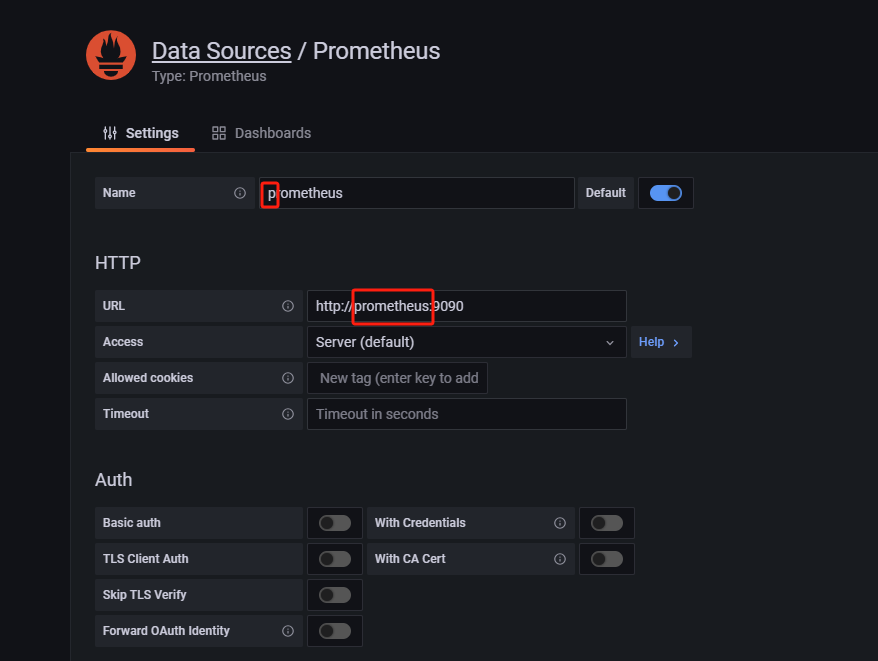

参考：

https://nacos.io/docs/latest/quickstart/quick-start-docker/

启动连接：

nacos:

http://localhost:8848/nacos

http://localhost:8848/nacos/actuator/prometheus

prometheus:

http://localhost:9090/graph

输入 nacos_monitor 然后 Execute

grafana

http://localhost:3000/

admin:admin

注意：

grafana 添加prometheus数据源, 第一个小写，第二个填写docker 主机名 或者 docker container 内部IP

为了与下面的json文件对应

https://github.com/nacos-group/nacos-template/blob/master/nacos-grafana.json

