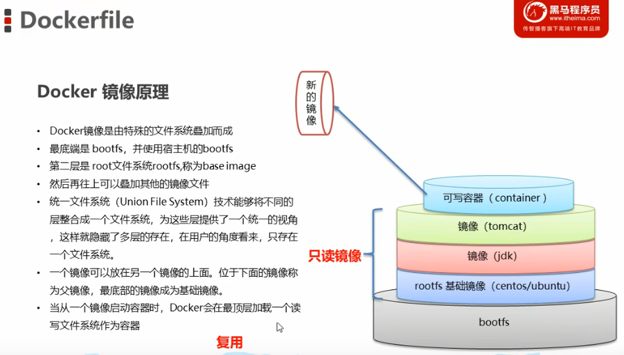

### 安装WSL
`wsl --install`

`wsl -l -v`
result:Ubuntu                 Running         2

在wsl 中运行docker的container 比用 docker desktop 要少   

在开始菜单搜索ubuntu就可以进入子系统


Docker镜像本质是什么?

进程调度子系统.
进程通信子系统
内存管理子系统
设备管理子系统
文件管理子系统

bootfs 都是一样的(such as ubuntu, centos...)
rootfs 不同
网络通信子系统作业控制子系统

Docker中一个centos镜像为什么只有200MB，而一个centos操作系统的iso文件要几个个G?

Docker中一个tomcat镜像为什么有500MB，而一个tomcat安装包只有70多MB?


### 镜像制作
Docker镜像如何制作?

1 容器转为镜像

docker commit 器id 镜像名称: 版本号

docker save -o 压缩文件名称 镜像名称:版本号

docker load -i 乐缩文件名称

2 dockerfile


### 私有仓库搭建

#### 1、拉取私有仓库镜像

`docker pul1 registry
`
#### 2、启动私有仓库容器

`docker run -id --name=registry -p 5000:5000 registry
`
#### 3、打开浏览器 输入地址http://私有仓库服务器ip:5000/v2/-catalog,看到“repositories":[]} 表示私有仓库 搭建成功

#### 4、修改daemon.json

`vim /etc/docker/daemon.json`

#### 在上述文件中添加一个key，保存退出。此步用于让 docker 信任私有仓库地址，注意将私有仓库服务器ip修改为自己私有仓库服务器真实ip

["insecure-registries":["私有仓库服务器io:5000"]]

#### 5、重启docker 服务

`systemctl restart docker
`
`docker start registry`

### 将镜像上传至私有仓库

#### 1、标记造像为私有仓库的镜像

`docker tag centos:7 私有仓库服务器IP:5000/centos:7
`
#### 2、上传标记的镜像

`docker push 私有仓库服务器IP:5000/centos:7
`
###docker 命令

根据 **Dockerfile** build 出一个一个定制化的 image

`docker build -t mysql-5.7 .`

列出所有images

`docker images`

移除image

`docker image rm xxx`

###docker-compose命令
重新启动已经定义在docker-compose.yml文件中的所有服务，并在后台运行它们

`docker-compose up -d`

如果你只想重新启动某个特定的服务，而不是所有服务，可以使用以下命令：

_"xxx uses an image, skipping" 这个信息通常出现在Docker Compose的输出中，表示某个容器在启动时已经存在并且已经使用了指定的镜像，所以Docker Compose 跳过了拉取新镜像的步骤，而直接使用已有的镜像来启动容器_

`docker-compose up -d <service_name>`

如果你需要重新构建容器，以便更新镜像或配置，可以使用docker-compose build命令

`docker-compose build`

如果你需要停止和删除Docker Compose中的容器

_**如果想在docker-compose.xml修改的密码生效 需要删除挂在文件**_

`docker-compose down`

### network

`docker network ls`

网络模式	简介

Host	容器将不会虚拟出自己的网卡，配置自己的IP等，而是使用宿主机的IP和端口。

Bridge	此模式会为每一个容器分配、设置IP等，并将容器连接到一个docker0虚拟网桥，通过docker0网桥以及Iptables nat表配置与宿主机通信。

None	该模式关闭了容器的网络功能。

Container	创建的容器不会创建自己的网卡，配置自己的IP，而是和一个指定的容器共享IP、端口范围。

自定义网络	略

### 启动命令

`docker build -f config-server/Dockerfile -t config-server:v1.0 .`

`docker-compose -f docker-compose-rabbitmq.yaml -f docker-compose-mysql.yaml up -d`

`docker-compose -f docker-compose-rabbitmq.yaml -f docker-compose-mysql.yaml down --remove-orphans`

`docker-compose -f docker-compose-rabbitmq.yaml up -d`

#### rabbitmq 集群
`docker exec -it rabbit2 /bin/bash -c "rabbitmqctl stop_app;
rabbitmqctl reset;  
rabbitmqctl join_cluster rabbit1@rabbit1; 
rabbitmqctl start_app;
exit;"`

`docker exec -it rabbit3 /bin/bash -c "rabbitmqctl stop_app;
rabbitmqctl reset;  
rabbitmqctl join_cluster rabbit1@rabbit1;
rabbitmqctl start_app;
exit;"`

#### 设置数据同步策略
`docker exec -it rabbit1 /bin/bash` 

`rabbitmqctl set_policy my_ha "^" '{"ha-mode":"all"}' `

### idea wsl docker mysql 错误
1. [ERROR] --initialize specified but the data directory has files in it. Aborting.
   
   删除临时文件
2. [ERROR] Could not set file permission for ca-key.pem

   镜像改为 mysql:5.7.16
3. Warning: World-writable config file is ignored

   添加如下代码
   ````
   entrypoint: >
      /bin/sh -c "chmod 0444 /etc/mysql/conf.d/my.cnf
      && docker-entrypoint.sh mysqld"
   ````


