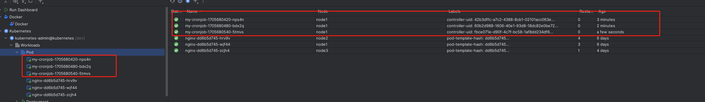

### cron 规则说明
```
* * * * *
- - - - -
| | | | |
| | | | +----- 星期（0 - 7）（星期天可以是0或7）
| | | +------- 月份（1 - 12）
| | +--------- 日期（1 - 31）
| +----------- 小时（0 - 23）
+------------- 分钟（0 - 59）
```
示例：

0 1 * * *表示在每天凌晨1点执行任务，

*/15 * * * *表示每15分钟执行一次任务

### K8S CronJob

`kubectl explain CronJob`

**会一直创建pod 并且等会会删除pod 感觉会删除三分钟之前**

