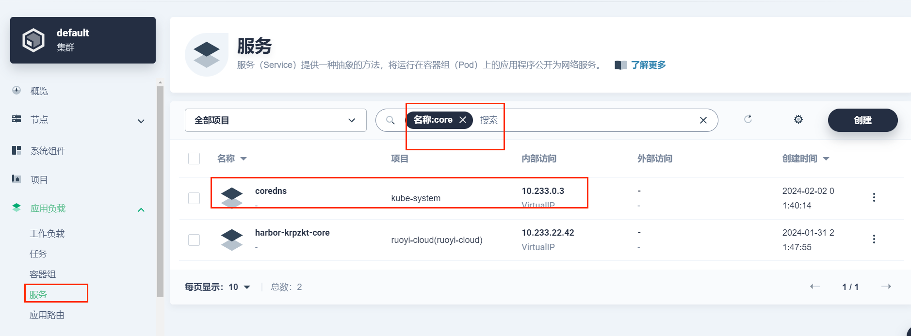
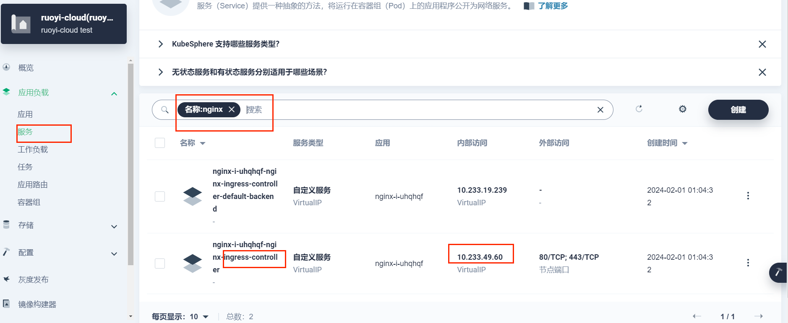

关键代码

line 55 [localCDNconfigMap.yaml](localCDNconfigMap.yaml)

````
forward . 10.233.0.3 {
    force_tcp
}
````
地址来自 coredns service


line 19 [configMap.yaml](configMap.yaml)
````
hosts {
    10.233.49.60 core.harbor.domain
    fallthrough
}
````
地址来在nginx controller service


````
kubectl delete cm nodelocaldns coredns -n kube-system

kubectl apply -f configMap.yaml,localCDNconfigMap.yaml

kubectl rollout restart deployment coredns  -n kube-system

````