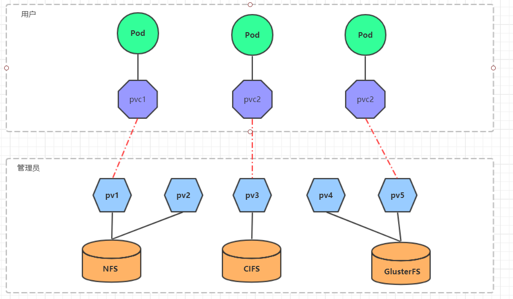

### PV PVC 关系


#### pv
```
apiVersion: v1  
kind: PersistentVolume
metadata:
  name: pv2
spec:
  nfs: # 存储类型，与底层真正存储对应
  capacity:  # 存储能力，目前只支持存储空间的设置
    storage: 2Gi
  accessModes:  # 访问模式
  storageClassName: # 存储类别
  persistentVolumeReclaimPolicy: # 回收策略
```

`mkdir /root/data/nfs/{pv1,pv2,pv3} -pv`

`vim /etc/exports`
````
/root/data/nfs/pv1     192.168.154.0/24(rw,no_root_squash)
/root/data/nfs/pv2     192.168.154.0/24(rw,no_root_squash)
/root/data/nfs/pv3     192.168.154.0/24(rw,no_root_squash)
````

`systemctl restart nfs`

#### pvc

````
apiVersion: v1
kind: PersistentVolumeClaim
metadata:
  name: pvc
  namespace: dev
spec:
  accessModes: # 访问模式
  selector: # 采用标签对PV选择
  storageClassName: # 存储类别
  resources: # 请求空间
    requests:
      storage: 5Gi
````
#### pod

创建pod

`kubectl create -f pv-pvc-pods.yaml`

查看pod,pv,pvc

`kubectl get pv,pvc,pods -n dev -o wide`

查看pv

`kubectl get pv -n dev -o wide`

查看nfs中的文件存储


