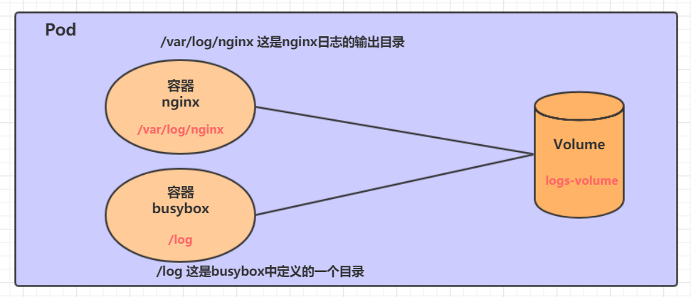
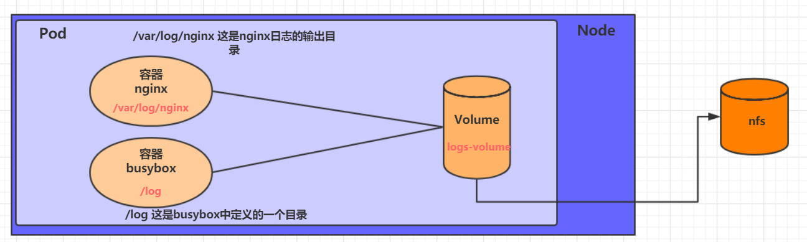

## 基本存储
### EmptyDir


`kubectl create -f emptydir.yaml`

查看pod

`kubectl get pods volume-emptydir -n dev -o wide`

通过podIp访问nginx

`curl 10.42.2.9`


通过kubectl logs命令查看指定容器的标准输出

`kubectl logs -f volume-emptydir -n dev -c busybox`

### hostPath


创建Pod

`kubectl create -f hostpath.yaml`

查看Pod

`kubectl get pods volume-hostpath -n dev -o wide`

访问nginx

`curl 10.42.2.10`

接下来就可以去host的/root/logs目录下查看存储的文件了
`ls /root/logs/`


### nfs



`mkdir /root/data/nfs/simple -pv`

`vim /etc/exports`
````
/root/data/nfs/simple     192.168.154.0/24(rw,no_root_squash)
````

`systemctl restart nfs`

创建pod

`kubectl create -f nfs.yaml`

查看pod

`kubectl get pods volume-nfs -n dev`

查看nfs服务器上的共享目录，发现已经有文件了

`ls /root/data/nfs`